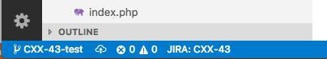

# JIRA Link for Visual Studio Code

JIRA Link will detect the current issue you are working on and will display
a link in the status bar.

The detection of the issue use the current git branch name.

## Extension Settings

This extension contributes the following settings:

* `jiraLink.instanceUrl`: Set the base url of your JIRA instance
